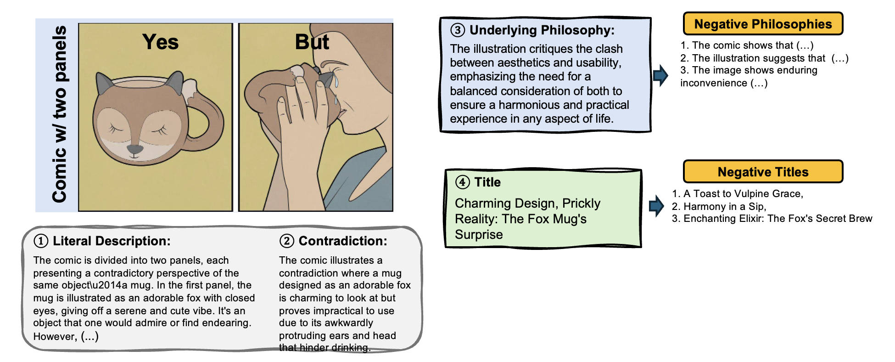

# YESBUT
This project offers the codes run in the Paper ([Arxiv](https://arxiv.org/pdf/2405.19088))

## Our Goals

We aim to challenge AI systems in their ability to recognize and interpret visual humor, grasp nuances in human behavior, comprehend wordplay, and appreciate cultural references. This understanding can enhance AI's ability to interact with users, generate creative content, and interpret multimedia content more effectively, thereby improving user experience in various applications such as content recommendation systems, virtual assistants, and automated content creation tools.

We collect and annotate images which convey various forms of visual humor and storytelling through simple comic panels. They explore themes such as human behavior, animal antics, and wordplay, often leading to unexpected or ironic conclusions.
<div align='left'></div>

## Dataset

### Download
- [Download](https://github.com/Tuo-Liang/YESBUT/blob/main/data/YesBut_data.json)
- As the copyright of original YESBUT images, We can't share the image dataset directly. We offer codes in [Download codes](https://github.com/Tuo-Liang/YESBUT/blob/main/Download/download_image.py) to download the images throught the url links we collected in our json file.
- Further, we offer some codes to process these YesBut images in /utils.

### Data Collection of YES-BUT
- Official YES-BUT Image Links: [Instagram](https://www.instagram.com/_yes_but/?hl=en), [Twitter](https://twitter.com/_yesbut_), Telegram

### Annotated data
- The file is in /data/YesBut_data.json
- The file has the fomat such as following.
```
 {
        "image_file": "00001.jpg",
        "description": "The comic is divided into two panels, each presenting a contradictory perspective of the same object\u2014a mug. In the first panel, the mug is illustrated as an adorable fox with closed eyes, giving off a serene and cute vibe. It's an object that one would admire or find endearing. However, in the second panel, we see a person drinking from this fox-shaped mug. The contradiction lies in the mug's impracticality: its ears and head protrude awkwardly, obstructing the person's ability to sip comfortably. Despite its endearing appearance, the mug fails its primary function as a practical vessel for beverages.",
        "caption": "The comic is divided into two panels, each presenting a contradictory perspective of the same object\u2014a mug. In the first panel, the mug is illustrated as an adorable fox with closed eyes, giving off a serene and cute vibe. It's an object that one would admire or find endearing. However, the second panel reveals a practical issue: a person attempts to drink from the fox-shaped mug, but its design\u2014featuring protruding ears and head\u2014awkwardly interferes, complicating the act of sipping comfortably.",
        "contradiction": "The comic illustrates a contradiction where a mug designed as an adorable fox is charming to look at but proves impractical to use due to its awkwardly protruding ears and head that hinder drinking.",
        "moral": "The illustration critiques the clash between aesthetics and usability, emphasizing the need for a balanced consideration of both to ensure a harmonious and practical experience in any aspect of life.",
        "title": "Charming Design, Prickly Reality: The Fox Mug's Surprise",
        "neg_title": [
            "A Toast to Vulpine Grace",
            "Harmony in a Sip",
            "Enchanting Elixir: The Fox's Secret Brew"
        ],
        "neg_moral": [
            "The comic shows that adding more decorative elements to an object will enhance its value and enjoyment, when in fact, the opposite is true in this case.",
            "The illustration suggests that the initial charming appearance of an item will always lead to a positive overall experience, disregarding any practical complications that arise later.",
            "The image shows enduring inconvenience is a worthwhile sacrifice for the sake of owning something that looks unique or cute."
        ],
        "category": "the theme of expectation versus reality",
        "moral_mcq": "A. The comic shows that adding more decorative elements to an object will enhance its value and enjoyment, when in fact, the opposite is true in this case.\nB. The illustration critiques the clash between aesthetics and usability, emphasizing the need for a balanced consideration of both to ensure a harmonious and practical experience in any aspect of life.\nC. The illustration suggests that the initial charming appearance of an item will always lead to a positive overall experience, disregarding any practical complications that arise later.\nD. The image shows enduring inconvenience is a worthwhile sacrifice for the sake of owning something that looks unique or cute.",
        "moral_mcq_answer": "B",
        "title_mcq": "A. A Toast to Vulpine Grace\nB. Charming Design, Prickly Reality: The Fox Mug's Surprise\nC. Enchanting Elixir: The Fox's Secret Brew\nD. Harmony in a Sip",
        "title_mcq_answer": "B",
        "url": "https://pbs.twimg.com/media/F9Y1i8zXIAEtKy-?format=jpg&name=medium",
        "bounding_box": [
            [
                [
                    270,
                    12
                ],
                [
                    919,
                    529
                ]
            ],
            [
                [
                    270,
                    551
                ],
                [
                    919,
                    1068
                ]
            ]
        ]
    }

```

## Experimental Design

### Experimental Setting
- Sample components: (image, caption, contradiction, philosophy, title)

#### Task 1: Contradiction Generation
- Image Setting: p(contradiction|image)
- Full Setting: p(contradiction|image, caption)
	- oracle caption: written by annotators (upper bound)
 	- system caption: generated by VLM itself

#### Task 2: Title MCQ
- Image Setting: p(title_option|image)
- Full Setting: p(title_option|image, caption)
	- oracle caption: written by annotators (upper bound)
 	- system caption: generated by VLM itself

#### Task 3: Deep Philosophy MCQ
- Image Setting: p(philosophy_option|image)
- Full Setting: p(philosophy_option|image, caption)
	- oracle caption: written by annotators (upper bound)
 	- system caption: generated by VLM itself

## Related Works
- [MemeCap](https://arxiv.org/pdf/2305.13703.pdf): A Dataset for Captioning and Interpreting Memes
- [DeepEval](https://arxiv.org/pdf/2402.11281.pdf): Can LMMs Uncover Deep Semantics Behind Images?
- [Humor Understanding Benchmarks from The New Yorker Caption Contest](https://arxiv.org/pdf/2209.06293.pdf)


